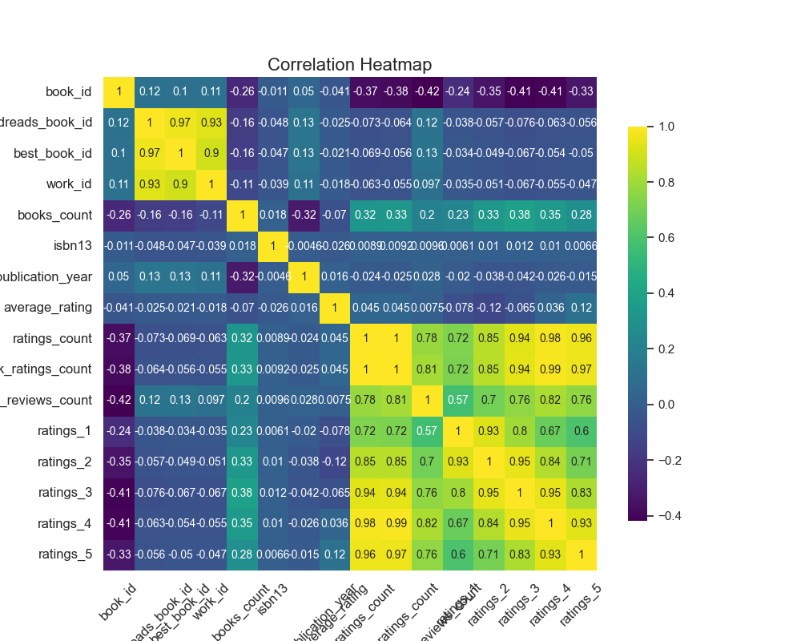

### Narrative Analysis of Goodreads Dataset 

#### Overview
The dataset `goodreads.csv` comprises 10,000 entries related to books listed on Goodreads, encompassing various attributes such as ratings, publication years, authors, and more. With rich datasets like this, we can unearth patterns, anomalies, and gain insights into reader preferences and book popularity.

#### Summary of Findings

1. **General Statistics**:
   - The dataset contains a variety of book-related metrics, including average ratings, ratings count, work ratings count, and different levels of ratings (1 to 5).
   - The `average_rating` for the books sits at approximately 4.00, indicating a predominantly positive reception. The standard deviation is relatively low (about 0.25), suggesting that ratings are fairly consistent across the dataset.

2. **Ratings Distribution**:
   - The maximum ratings count for any book is 4,780,653, while the minimum is 2,716, illustrating that there are significant outliers in ratings. This substantial disparity in `ratings_count` hints towards a wide variety of popularity levels among the books, with a few titles gathering massive followings.

3. **Trends Over Time**:
   - The `original_publication_year` has a mean of approximately 1982. This suggests that many of the books under consideration are relatively older, with the maximum publication year being 2017. It could be insightful to investigate if newer publications follow the same rating trends as older titles.

4. **Author Popularity**:
   - The most frequently mentioned author is Stephen King, which aligns with the common knowledge of his widespread popularity. Further analysis on the correlation between an author's presence and their books' ratings could provide insights into the 'author effect' on readers' evaluations.

5. **Correlation Insights**:
   - There are strong correlations among the `ratings_count`, `work_ratings_count`, and various ratings categories (1 to 5). This indicates that as total ratings increase, all levels of individual ratings generally increase as well.
   - We observe a negative correlation between `books_count` and some rating-related variables, suggesting that books with a larger number of editions or variations may not perform as well in terms of ratings, possibly due to customer dissatisfaction with certain versions.

6. **Missing Values**:
   - Key columns like `isbn`, `isbn13`, and `original_title` have some missing entries. Future data quality checks or attempts to fill in these blanks could enhance the dataset's usability.

7. **Language Considerations**:
   - The dataset consists of books in 25 different languages, predominantly English, which could allow for book preference analysis across different linguistic audiences.

### Further Analysis Suggestions

1. **Clustering Analysis**:
   - **K-Means Clustering**: We could segment books into different clusters based on attributes such as average ratings, ratings counts, and publication years. This approach may lead to discovering unique groupings of books that share characteristics, such as a cohort of high-rated classics or a collection of modern, niche hits.
  
2. **Anomaly Detection**:
   - **Isolation Forest or DBSCAN**: Implementing anomaly detection algorithms could help identify books with ratings significantly different from expectations based on their publication year, genre, or author popularity. Outliers might represent either massively successful or significantly underrated works.

3. **Trend Analysis Over Time**:
   - Conducting a time series analysis on the `ratings_count` and `average_rating` over the years could reveal trends, such as whether older books are consistently holding their appeal or if newer titles are beginning to dominate ratings.

4. **Author Influence Analysis**:
   - Investigating the correlation between author frequency and average ratings may yield insights into the influence of bestselling authors on readers’ habits.

### Implications for Future Decisions

1. **Targeted Marketing**:
   - Understanding which genres or types of books are trending can help publishers and retailers target their marketing efforts effectively, promoting books that are likely to resonate with readers based on observed behaviors.

2. **Inventory Management**:
   - Insights about which authors or titles require more shelf space or promotional pushes can help optimize inventory decisions in bookstores or libraries.

3. **New Release Prioritization**:
   - By assessing past publication years of successful books, publishers can better time their releases or adapt their marketing strategies to fit current reader preferences.

4. **Data Cleaning and Completeness**:
   - Prioritizing efforts to fill in missing values (such as `isbn` and `original_title`) will enhance the dataset's integrity and reliability for future analyses.

#### Conclusion
The analysis of the `goodreads.csv` dataset provides a clear perspective into the world of books as recognized by readers on Goodreads. Through advanced analyses like clustering and anomaly detection, further insights can be gained, leading to better decision-making in publishing, marketing, and inventory management within the literary landscape.

